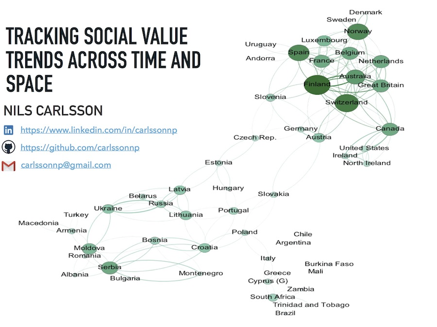
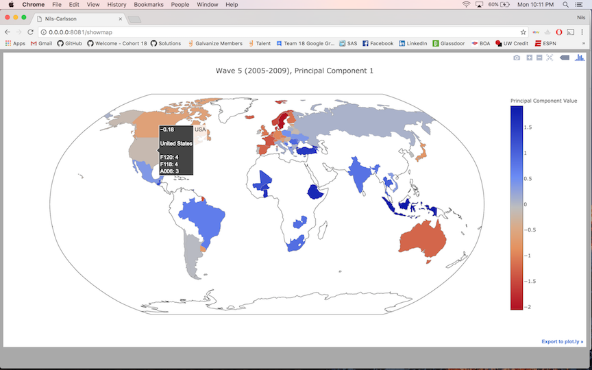
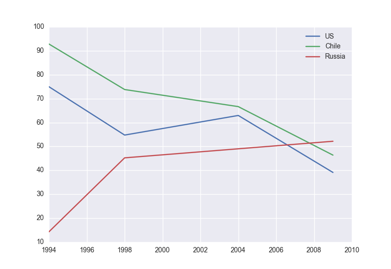

In this project, I use data from the World Values Survey and European Values Survey to track social values across time and space: space, because the surveys cover over 100 countries across the globe, and time, because the surveys are cross sectional, covering the years 1981 through 2014. Each survey contains hundreds of questions on a diverse set of topics, including politics, family, economics, religion, and more. While the surveys hold great potential for comparison between countries and time periods, the sheer volume of questions makes it difficult to make comparisons between countries (space) and survey period (time) on a question by question basis. I hope to make this comparison easier by reducing the dimensionality of the survey using Principal Component Analysis (PCA), finding overarching themes that are explained by clusters of questions, and then presenting the results in pictorial format via a Flask app.

Quick description of folders:

Code: contains all of the code necessary for the project, including:

- the data loading/analysis file : analyze_surveys.py
- a text file mapping numerical country codes to country names: country_codes.txt
- a file that creates a python dictionary mapping numerical country codes to country names: country_dictionary.py
- a file that determines what questions to select from the surveys: question_selector.py
- the Plotly mapping file: plotly_choropleth.py
- the Flask web app file: app.py
- html/css files for use with the app file: html_files folder and static folder, respectively
- Gephi graph files: Gephi_Files
- pickled dictionaries of principal component values for use with the app file: pickled_correlation_dictionaries.py
- the codebook for identifying survey questions: codebook.csv
- a list my interpretations of the principal components for each time period: principal_components_list.md

EVS: Folder than contains data files on my machine. Due to size constraints, no data will be uploaded to Github. On Github, this folder only contains the data dictionary. Anyone interested in taking a look at the survey data themselves can use the following link:
http://www.europeanvaluesstudy.eu/

WVS: Folder than contains data files on my machine. Due to size constraints, no data will be uploaded to Github. On Github, this folder only contains the data dictionary. Anyone interested in taking a look at the survey data themselves can use the following link:
http://www.worldvaluessurvey.org/wvs.jsp

Presentation Materials: a keynote presentation of my results, as well as the associated images

# Analysis Walkthrough

# Data Cleaning
The first step in the process was to download the data files from the World Values homepage and the European Values homepage, respectively. This data is offered both in time period-specific format (i.e., only the data from one particular time period/wave of the survey) and in an aggregated format. The issue with using the time period-specific format is that every wave of the survey has slightly different questions and/or question labels, so comparing different time periods can be a mess. Fortunately, the aggregated format takes care of this by grouping similar questions together under the umbrella of one question, so this is the format I chose to work with.

The World Values Survey (WVS) has been administered with more frequency than the European Values Survey (EVS), meaning there is not a one-to-one correspondence between time periods covered by the WVS and EVS. So I manually matched the time periods of the EVS to the time periods of the WVS that best corresponded to one another. After this was done, the surveys were ready to be merged: I appended the EVS to the WVS, and the data was ready.

# Question Selection
I now had a pandas DataFrame that contained answers to hundreds of questions from over 100 countries. The questions were of three main types:

1. ordinal categorical (Question A006 - Important in Life: religion [1: Very Important, 4: Not at all important])
2. non-ordinal categorical (Question E001 - Aims of country: 1: High level of economic growth, 2: Strong defense forces, 3: People have more say about how things are done, 4: Trying to make our cities and countryside more beautiful)
3. binary (Question A016 - Ever felt on top of the world: 0. No, 1. Yes ).

Principal component analysis is really designed to work with continuous variables, as comparing variance between continuous and categorical variables can be tricky. So for my first pass at this project I restricted the questions to those that were ordinal categorical, and treated them as continuous.

# Missing data
There was a substantial amount of missing data in the survey, as is often the case with data generated from human sources. This missing data came in three main forms:

1. A question was asked, and a particular respondent did not answer.
2. The question was asked only in certain countries during a particular survey wave.
3. The question was only asked during a particular survey wave, and not in other time periods.

To deal with 3., I decided to perform my analyses for each wave separately. For 1. and 2., I think matrix factorization holds great promise (similar to filling in missing ratings in a user-ratings matrix for a recommender system), or using a K-nearest neighbors missing data imputation algorithm. Due to the short time frame of this project, I left this as a future step to take.

Since PCA does not work with missing values, in each time period I only included questions that were responded to by over 70% of the population in that time period. Any individuals with missing values were then dropped from the analysis.

# Choice of topic analysis method
The two methods of topic extraction that I considered were PCA and Non-negative Matrix Factorization (NMF). I opted to use PCA because it would decompose the surveys into topics that capture in decreasing order the variance in the data. This would make it easy for me to see which topics were most divisive, i.e. what topics were drivers of variance in societal attitudes. NFM also extracts topics but is not based on this premise of variance explanation.

# Laying out the analysis plan
The plan was to first separate the survey by time period, and then perform PCA on each distinct time period. Then, for each principal component, I would calculate the correlation of each survey question with that component. The survey questions most correlated with that component would then define the topic represented by that component.

# Exploratory data analysis
To get a feel for how my analysis would proceed, I chose a small subset of questions to perform PCA on, and only used the first wave. From this preliminary analysis, I found that the first principal component was most correlated with question A170: satisfaction with your life. This was an interesting finding, so I investigated further and discovered an issue: this question was on a scale of 1-10, not 1-4 as many of the other questions! I looked through more of the questions and saw that many of the questions were on different scales; some were 1-3, some were 1-4, and some were 1-10.

This posed a problem for my analysis because the questions with larger ranges of answers would likely have higher variance than the questions with smaller ranges, meaning that PCA analysis would pick up on those questions with higher ranges. To deal with this, I min-maxed scaled each survey question, so that the range would be the same. I used this type of scaling rather than standardizing the data because the min-max method still allows each feature to have a unique variance, whereas standardizing the features would lead to unit variance across the board, taking away from my ability to discern overall variance in the data.

# PCA results
After performing PCA, I found that in each time period, the first principal component was always most correlated with questions that quantified two subjects: 

1. Religion (questions that quantified importance of religion, regular attendance in church, etc. )

2. Social conservatism (questions that quantified attitudes towards homosexuality, abortion, divorce, etc. ). It was not entirely surprising to me that these two topics went hand-in-hand, as religion is often associated with conservative social views. I found it noteworthy, though, that the theme represented by the first principal component was so consistent across time: these results suggest that the single most divisive topic in human attitudes across a time span ranging from 1981 through 2014 is a combination of religious views and the social conservatism that often accompanies it! I have laid out the questions most associated with the first principal component for each time period below.

1. 1981 - 1984
    1. F120: Is abortion justifiable? [1: Never, 10: Always] Correlation: 0.75
    2. F063: How important is God in your life? [1: Not at all important, 10: Very important] Correlation: -0.72
    3. F121: Is divorce justifiable? [1: Never, 10: Always] Correlation: 0.72
2. 1990 - 1994
    1. F063: How important is God in your life? [1: Not at all important, 10: Very important] Correlation: -0.72
    2. A006: How important is religion in your life? [1: Very important, 4: Not at all important ] Correlation: 0.71
    3. F067: How often do you pray to God outside of religious services [1: Often, 5: Never] Correlation: 0.69
3. 1995 - 1998
    1. F063: How important is God in your life? [1: Not at all important, 10: Very important] Correlation: -0.72
    2. A006: How important is religion in your life? [1: Very important, 4: Not at all important ] Correlation: 0.72
    3. F120: Is abortion justifiable? [1: Never, 10: Always] Correlation: 0.70
4. 1999 - 2004
    1. A006: How important is religion in your life? [1: Very important, 4: Not at all important ] Correlation: 0.74
    2. F066: How often do you pray to God outside of religious services [1: Everyday, 7: Never] Correlation: 0.72
    3. F063: How important is God in your life? [1: Not at all important, 10: Very important] Correlation: -0.71
5. 2005 - 2009
    1. F120: Is abortion justifiable? [1: Never, 10: Always] Correlation: 0.74
    2. F118: Is homosexuality justifiable? [1: Never, 10: Always] Correlation: 0.73
    3. A006: How important is religion in your life? [1: Very important, 4: Not at all important ] Correlation: 0.73
6. 2010 - 2014
    1. F202 : Whenever science and religion conflict, religion is always right. [1: Strongly agree, 4. Strongly disagree] Correlation: 0.71  
    2. A006: How important is religion in your life? [1: Very important, 4: Not at all important ] Correlation: 0.70
    3. F203: The only acceptable religion is my religion [1: Very important, 4: Not at all important ] Correlation:     0.62

# Comparing countries/geographical regions  

After deducing the meaning of the 1st principal component in each time period using the survey questions detailed above, I compared different countries within each time period using their value for the component. Below is an example of the app I created, which allows a user to enter both a time period and a principal component number and view countries shaded by their value for that principal component. Not surprisingly, Western Europe has very low values, which is consistent with the general consensus that the countries that comprise it are relatively secular and socially liberal. Eastern Europe, Africa, and parts of South America have much higher values.

# Change within countries over time

I also thought it would be interesting to take a look at how individual countries changed over time. Below are time series' for the three countries with the biggest change over time.

# Lasting Impressions

If I could sum it all up in one sentence: religion has been, and continues to be, an extremely divisive topic! Attitudes differ markedly according to geographical region, with Western Europe generally being the least religious/most socially liberal, and African nations having the strongest levels of religion and social conservatism.

Future work includes investigating principal components beyond the 1st, and also including non-ordinal categorical and binary survey questions. I will also be putting my visualization app online in the near future. Finally, I would like to develop an intelligent method for imputing missing data, perhaps via K-Nearest Neighbors or using a matrix factorization method, similar to those used in recommender systems.

Thanks for following along, I hope you learned something! Feel free to contact me at carlssonnp@gmail.com with any questions.  
